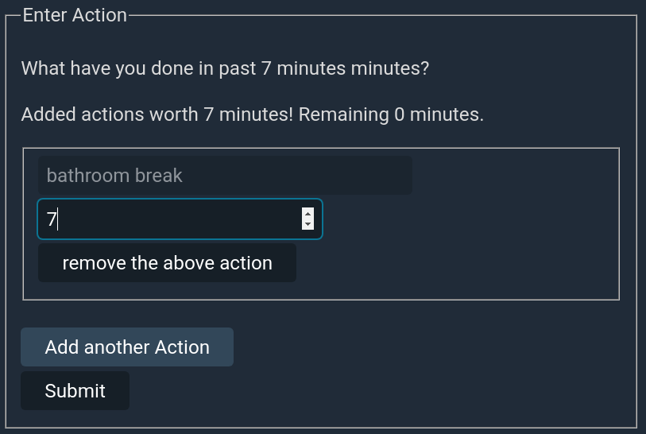

<h1>GUARDIAN</h1>

* [Purpose](#purpose)
* [Usage](#usage)

# Purpose
- This application allows users to keep track of their time spent on different activities. 
- The users can view how much time of their day has been spent doing which activity. 
- Plots like bar charts help the users plan the remaining time of their day in an efficient manner. 
- The application is beneficial for people who wonder where all their time goes, want to stop procrastinating and want to use their time productively.

# Usage

**Step 1:** Login (or register if you are a new user)

**Step 2:** Enter the activities for which you wish to keep a log. Once you're done adding activities, click on the "Submit" button.

You can incrementally keep adding activities as you go on using the app.

**Step 3:**  Log the time you spent on an activity.

- Click on the "Log Action" button.

- Select the required activity from the dropdown.

- Enter the time spent doing that activity. Time for an action has to be entered in minutes.

Once you start logging, you have to enter actions for all the remaining time (i.e. till the remaining time becomes 0). Once you have accounted for all the remaining time, click on the "Submit" button.

**Step 4:** Click on the button "Fetch chart of the day!".

The following would be displayed: -

- <a name="bar_chart_with_activity_vs_time">The bar chart showing the time spent on each activity.</a>

- The graph showing the time spent for each activity and also whether it's increasing or decreasing from one day to another. The colour codes for the activities are in the [above screenshot](#bar_chart_with_activity_vs_time).

- The bar chart showing the certainty for each activity. According to the app, the more actions you log at a time, the more uncertain you are of the actual time spent on each action.

- The final plot shows the activities and the time spent on them for each certainty level. The colour codes for the activities have been shown in the screenshot showing the [bar chart for activity vs time spent](#bar_chart_with_activity_vs_time). You can hover over a point on the graph to know the activity that the point represents, the certainty with which it was entered and time spent doing that activity.

